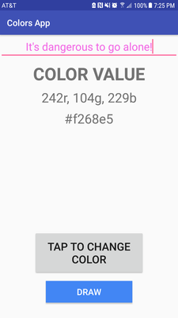
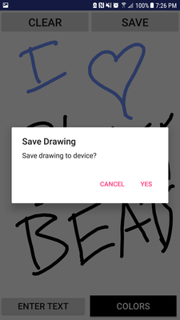

# colors-app
**Fun with colors and drawing.**

This application is my take on the first required homework for CEG 4110 at WSU. The intention of this assignment is to test students' ability to work within a mobile development environment and to prepare them for the overall group assignment that largely makes up rest of the course. The application is simple: the first activity allows the user to enter text and randomly change the text color, and the second activity allows the user to draw an image to the screen with various colors. The user also has the ability to save their art to their device.

## MainActivity (Text Entry with Random Colors)


`MainActivity` is the initial activity of this application.

The user can enter a string of text at the top of the screen and select the "Change Color" button which will set the text to a random color while also displaying the RGB and Hex value of that color.

The random color is set by calling `GetRandomSingleRGBValue()` three times and assigning the returned values to R, G, and B respectively. In this way, we can also send these values to the labels which will report the numerical and hexidecimal values of the random color.

The label values are set by calling the `SetColorStrings()` method whenever a new color is generated. This method handles creating these labels by taking in the integer values of the RGB color and setting the text of the `_rgbText` and the `_hexText` member variables to the equivalent values.

The hexidecimal values are obtained by taking each individual integer given for the RGB values and calling `Integer.toHexString()` which, when combined together gives us the complete hexidecimal representation for the new random color.


## DrawingActivity (User Drawing on Screen)


`DrawingActivity` is the second activity of this application which allows the user to draw on the screen, save the image they drew, clear the image they've drawn, or select a new color to draw on the screen with.

This activity implements a custom view called `DrawingCanvasView` created specifically for users to be able to draw on. The entire screen is an area in which the user can draw on, and when drawing the buttons will go transparent to allow the user to see past them and draw in their location. The buttons turn transparent as a result of being passed to the  `DrawingCanvasView` to respond to touch events in the view. The buttons are added by referencing the stored reference to the view and calling `_drawingCanvas.AddButton()`.

When the user presses the _Save_ button, the `SaveCanvas()` method is called which asks for permissions to save to device and then calls `LoadBitmapFromView()`, returning a bitmap of the view which is then saved as an image _(so long as the user accepts the permissions and OK's the save prompt!)_.

The user is also able to clear the screen by pressing the _Clear_ button. This calls the `ClearCanvas()` method in the `DrawingCanvasView` which resets the view.

<div align="center">

</div>

When drawing, the user can also select another color to draw with. This is done by calling the `ColorPick()` method. When the user selects a color from the colorwheel, they can then draw onto the screen and the path will then be drawn in the newly selected color. This method does this by setting the reference to the `DrawingCanvasView`'s paint color in its `SetPaint()` method. The background color is also changed for the colors button to show which color the user has selected currently.

## DrawingCanvasView (Custom Drawing Canvas View)
`DrawingCanvasView` is a custom view which enables drawing on a canvas. This can be used in any android application to add the ability for users to draw. The previous section shows how some of the public functions are used to interact with the view. This is a quick run down of them:

- `AddButton()` - Add a button from the Activity to be made transparent when the user is drawing over the area.

- `SetPaint()` - Sets the current paintbrush color to the given color.

- `GetPaintColor()` - Returns the current paintbrush color.

- `ClearCanvas()` - Clears the canvas by resetting it to defaults.

The rest of the custom view consists of several other private or protected functions, including the `OpaqueButtons()` and `TransparentButtons()` methods. Both of these methods check to see if the buttons list is empty, and if it is not, they either make the buttons transparent or opaque, respectively. These are called when the user is drawing on the screen. They are called when the user is drawing which is in response to the `onTouchEvent()`. When this event triggers, it handles whether or not the user has just started drawing, is moving, or has stopped drawing and handles the path logic.

As the user draws paths onto the screen, the `onTouchEvent()` keeps track of the beginning and ending times of the path drawing and adds it to the canvas bitmap.

**Don't forget save your masterpiece to your device!**
<div align="center">
    
</div>

### Dependencies

There is one main [external dependency](https://github.com/duanhong169/ColorPicker) in this project made up by the color picker library. Include this in `build.gradle` to implement:
```
dependencies {
    ...
impleme which returns:1.1.2'
    ... which returns
}
```

### Resources
This app was created with the help of a few kind individuals on the internet sharing their knowledge and abilities.

- [Color Picker](https://github.com/duanhong169/ColorPicker) library implemented to allow users to select a color to draw with.

- [Helpful Article](https://code.tutsplus.com/tutorials/android-sdk-create-a-drawing-app-touch-interaction--mobile-19202) for understanding drawing in an android application.